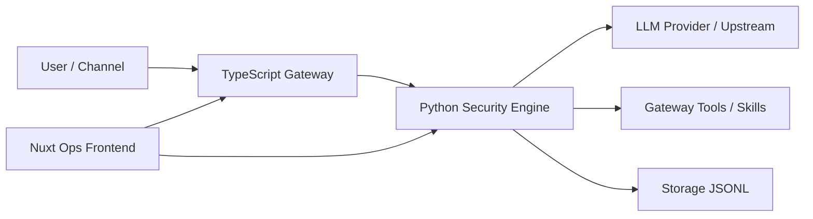

# Pangolin 项目全景分析（教师汇报版）

> 版本快照日期：2026-03-21  
> 适用场景：课程汇报、项目答辩、技术评审

---

## 1. 项目一句话

Pangolin 是一个面向多智能体与多渠道通信场景的安全运行时平台：

- TypeScript 负责网关、CLI、插件与渠道接入（控制面 + 通信面）。
- Python 负责安全分析与防护引擎（策略面 + 审计面）。
- Nuxt 前端负责可视化运维、策略操作和实验场景验证（展示面）。

它不是单纯聊天应用，而是“可治理、可审计、可扩展”的 Agent Runtime 基座。

---

## 2. 解决什么问题

### 2.1 传统痛点

1. 智能体调用外部工具时缺乏统一安全网，容易被 prompt injection、敏感数据泄漏、越权调用影响。
2. 多渠道接入（如 Telegram、Feishu、Web）通常各自为政，运维和权限模型割裂。
3. 生产运行缺少可观测性：出了问题只看到报错，无法回放请求、分析威胁来源。

### 2.2 Pangolin 的思路

1. 在模型调用与工具调用链路中间放置“安全防火墙”。
2. 网关统一协议、认证、会话和渠道接入。
3. 用审计日志 + Trace + 可视化大盘，建立可复盘、可治理的运行闭环。

---

## 3. 系统总体架构

从工程角度，它是“单仓双栈”架构：

- Node/TypeScript：连接、命令、插件、渠道、网关协议。
- Python/FastAPI：安全分析、策略判定、审计落盘、实验接口。

---

## 4. 子系统分解

## 4.1 TypeScript 网关与 CLI（主入口）

- 入口：`pangolin.mjs` -> `src/entry.ts`
- 网关核心：`src/gateway/server.impl.ts`
- 运行时：`src/runtime.ts`
- 命令体系：`src/commands/` + `src/cli/`

核心职责：

1. 维护 Gateway WebSocket/HTTP 服务生命周期。
2. 统一认证模式（token/password 等）与运行时配置。
3. 支持渠道、插件、技能、节点和工具调用。
4. 提供 CLI 运维能力（onboard、doctor、status、gateway 等）。

## 4.2 Python 安全引擎（Firewall）

- 主入口：`src/main.py`
- 配置：`src/config.py`
- 安全引擎：`src/engine/`
- 代理层：`src/proxy/`
- 工具注册与执行：`src/gateway_tools.py`、`src/skills.py`

核心职责：

1. 对 chat 请求和 tools/call 做安全分析。
2. 通过规则层、语义层及策略节点做放行/拦截判定。
3. 输出审计事件、威胁评分、决策理由。
4. 对前端暴露监控和实验 API（例如 `/api/chat/send`）。

## 4.3 前端运维控制台（Nuxt 4）

- 目录：`apps/pangolin-frontend/`
- 主要页面：`/playground`、`/compare`、`/agent`、`/agent-traces`、`/middleware`、`/rules`、`/policies`、`/requests`、`/analytics`、`/settings`、`/mcp-firewall`

核心职责：

1. 提供安全实验场（Playground/Compare）。
2. 提供策略规则、请求日志、分析看板。
3. 提供 Agent Studio 多智能体编排可视化。

---

## 5. 目录与职责地图（汇报时可直接讲）

- `src/gateway/`：网关协议、认证、HTTP/WS、会话与插件相关。
- `src/commands/`：CLI 子命令与运维流程。
- `src/engine/`：Python 安全分析与流水线决策逻辑。
- `src/proxy/`：OpenAI/SSE 等代理与转发层。
- `src/routes/`：后端 REST 接口（trace、dataset、rules、analytics、agent-studio 等）。
- `skills/`：可调用技能目录（示例：weather、github、notion、slack 等）。
- `channel/` 和 `src/channels/`：渠道接入实现（含 Feishu 等）。
- `apps/pangolin-frontend/`：当前主前端。
- `frontend/`：另一套前端工程（更偏历史/兼容用途）。
- `docs/`：文档体系（含渠道文档、安全文档、部署文档）。

---

## 6. 核心流程（老师最关注）

## 6.1 流程 A：聊天请求的安全闭环

1. 前端发送请求到 Python 后端 `/api/chat/send`。
2. 后端先执行 L1/L2 分析与策略节点判定。
3. 若允许，再转发到上游模型（如 OpenRouter/OpenAI 兼容接口）。
4. 如发生工具调用，继续进入 tools/call 安全检查。
5. 全程产生分析事件并可落盘到 trace/audit。

关键意义：把“是否允许调用模型/工具”的控制权收敛到统一防线。

## 6.2 流程 B：工具调用安全链路

1. 模型输出工具调用（如 `run_skill` 或 `invoke_gateway`）。
2. 后端对工具参数做安全分析。
3. 通过后才执行网关工具或技能命令。
4. 执行结果回填到对话上下文，继续下一轮推理。

近期实践改进点（可作为迭代能力展示）：

- `weather <城市>` 增加命令归一化，自动转为 `curl wttr.in`，避免 `command not found`。
- 网关工具调用加入主/备凭据回退，降低鉴权失败概率。

## 6.3 流程 C：Agent Studio 多智能体编排

1. 入口：`/api/agent-studio/runs/stream`（NDJSON 流）。
2. 系统从 `src/agent_studio/catalog.py` 读取角色档案。
3. 将任务拆解为阶段批次（research/design/content/backend/frontend/quality gate）。
4. 调用 `/api/chat/send` 执行每个子任务。
5. 汇总结果并写入 `data/orchestration_runs.jsonl`。

关键意义：从“单 agent 对话”升级为“可编排的任务流水线”。

---

## 7. 安全设计亮点

## 7.1 多层分析与策略判定

`src/engine/pipeline/runner.py` 显示了 pre-LLM 的关键节点：

- parse
- intent
- rules
- scanners
- decision

这意味着模型调用前已有一轮防护，降低恶意输入直接触达上游模型的概率。

## 7.2 Gateway 认证治理

项目支持 token/password 等模式，并有监控接口：

- `/api/gateway-info`
- `/api/monitor/status`

可用于判断网关配置是否有效、凭据是否失效。

## 7.3 审计可追溯

JSONL 存储后端默认落盘：

- `data/traces.jsonl`
- `audit/firewall.jsonl`
- `data/annotations.jsonl`
- `data/datasets.jsonl`
- `data/policies.jsonl`

对于课堂汇报，可强调“所有关键决策可回放、可检索、可解释”。

---

## 8. 工程化成熟度（量化）

基于当前仓库快照统计：

- TypeScript 测试文件：873
- Python 测试文件：10
- 技能目录数量：51
- 渠道文档页面：29
- `src/` 下 Python 文件：78
- `src/` 下 TypeScript 文件：2517

说明：项目不是实验脚本级别，而是高复杂度、多模块、长期演进工程。

---

## 9. 开发与运行方式

## 9.1 依赖与启动

- Node 侧：`pnpm install`
- Python 侧：`uv sync`

一键本地联调：

- `pnpm pangolin:dev:all`

该脚本会同时启动：

1. Python 后端（默认 9090）
2. TS 网关
3. Nuxt 前端（默认 3000）

## 9.2 常用质量命令

- Node 检查：`pnpm check`
- Node 构建：`pnpm build`
- Node 测试：`pnpm test`
- Python 测试：`make test`
- Python Lint：`make lint`

---

## 10. 当前状态评估（客观）

## 10.1 优势

1. 架构分层清晰：网关、引擎、前端职责明确。
2. 安全机制实用：不仅分析输入，也分析工具调用。
3. 可观测性较强：Trace + Audit + Dashboard。
4. 编排能力突出：Agent Studio 有实际落地路径。

## 10.2 仍需完善点

1. 部分 `/v1/*` 路由仍是 stub（如 `policies.py`、`rules.py`、`analytics.py` 返回占位数据）。
2. 单仓内存在多套历史资产（如 `frontend/`、`ai-protector-main/`），对新人有理解成本。
3. 双栈协作复杂度高（Node + Python），环境与凭据管理要求较高。

这类“技术债 + 迁移中状态”恰恰是工程项目真实形态，也可在汇报中体现你对项目现状的客观判断。

---

## 11. 给老师的 8-10 分钟汇报脚本（可直接照讲）

## 11.1 第 1 分钟：定位

- 这是一个面向 AI Agent 的安全网关运行时，而非普通聊天机器人。
- 核心目标是“把 Agent 调用模型和工具的风险可控化”。

## 11.2 第 2-4 分钟：架构

- TypeScript 负责连接、协议、渠道、CLI。
- Python 负责安全引擎与策略决策。
- Nuxt 前端负责运维与可视化。

强调“单仓双栈”设计优势：功能快迭代 + 安全可独立演进。

## 11.3 第 5-6 分钟：关键流程

- 从 `/api/chat/send` 讲起：先分析再转发。
- 再讲 tools/call：不仅文本有防护，工具执行也有防护。
- 最后讲 Agent Studio：支持多角色并行协作产出。

## 11.4 第 7-8 分钟：工程化

- 展示测试规模、技能规模、文档覆盖。
- 展示一键开发命令和质量命令。

## 11.5 第 9-10 分钟：评估与改进计划

- 优点：架构、可观测、安全闭环。
- 不足：部分 API stub、历史资产混杂。
- 下一步：统一 API 契约、收敛历史前端、补齐真实分析端点。

---

## 12. 可回答的高频追问（答辩准备）

1. 为什么要双栈？

- 网关场景和 CLI 生态更适合 TS；安全分析与 ML 生态在 Python 更成熟。

2. 安全策略会不会影响可用性？

- 当前采用“前置判定 + 审计追踪 + 明确告警”，并支持逐步收紧策略阈值。

3. 是否支持真实生产部署？

- 有鉴权、日志、监控、配置、测试和脚本化启动基础，具备生产化基础能力。

4. 你个人贡献点怎么体现？

- 可结合具体迭代：规则页修复、卡片语义色、技能执行兼容、鉴权回退与 401 处理等。

---

## 13. 结论

Pangolin 的价值不在“某一个模型效果更好”，而在于把多智能体系统从“能跑”提升到“可控、可审计、可运维”。

从课程项目角度，它同时覆盖：

- 系统架构设计
- 安全工程
- 全栈工程落地
- 多智能体协作编排

这使它具备较强的教学展示价值和继续演进空间。
